# Lab – React Client for Blueprints (Redux + Axios + JWT)

> Basado en el cliente HTML/JS del repo de referencia, este laboratorio moderniza el _frontend_ con **React + Vite**, **Redux Toolkit**, **Axios** (con interceptores y JWT), **React Router** y pruebas con **Vitest + Testing Library**.
### Realizado por: Juan Daniel Bogotá y Carlos Rojas
## Objetivos de aprendizaje

- Diseñar una SPA en React aplicando **componetización** y **Redux (reducers/slices)**.
- Consumir APIs REST de Blueprints con **Axios** y manejar **estados de carga/errores**.
- Integrar **autenticación JWT** con interceptores y rutas protegidas.
- Aplicar buenas prácticas: estructura de carpetas, `.env`, linters, testing, CI.

## Requisitos previos

- Tener corriendo el backend de Blueprints de los **Labs 3 y 4** (APIs + seguridad).
- Node.js 18+ y npm.

Ver la especificación de glosario clave, consulta las [Definiciones del laboratorio](./DEFINICIONES.md).

## Endpoints esperados (ajústalos si tu backend quedo diferente)

- `GET /api/blueprints` → lista general o catálogo para derivar autores.
- `GET /api/blueprints/{author}`
- `GET /api/blueprints/{author}/{name}`
- `POST /api/blueprints` (requiere JWT)
- `POST /api/auth/login` → `{ token }`

Configura la URL base en `.env`.

## Cómo arrancar

```bash
npm install
cp .env.example .env
# edita .env con la URL del backend
npm run dev
```

Abre `http://localhost:5173`

## Variables de entorno

Crea un archivo `.env` en la raíz:

```variable
VITE_API_BASE_URL=http://localhost:8080/api
```

> **Tip:** en producción usa variables seguras o un _reverse proxy_.

## Estructura

```carpetas
blueprints-react-lab/
├─ src/
│  ├─ components/
│  ├─ features/blueprints/blueprintsSlice.js
│  ├─ pages/
│  ├─ services/apiClient.js   # axios + interceptores JWT
│  ├─ store/index.js          # Redux Toolkit
│  ├─ App.jsx, main.jsx, styles.css
├─ tests/
├─ .github/workflows/ci.yml
├─ index.html, package.json, vite.config.js, README.md
```

## 📌 Requerimientos del laboratorio

## 1. Canvas (lienzo)

- Agregar un lienzo (Canvas) a la página.
- Incluir un componente `BlueprintCanvas` con un identificador propio.
- Definir dimensiones adecuadas (ej. `520×360`) para que no ocupe toda la pantalla pero permita dibujar los planos.

### Respuesta
Se agregó `id="blueprint-canvas"` al elemento `<canvas>` en `src/components/BlueprintCanvas.jsx`. Las dimensiones (`520×360`, valores por defecto del componente) ya estaban definidas correctamente en el starter.

Para poder validar esto (y el resto del laboratorio) fue necesario corregir dos problemas de configuración de pruebas que impedían que la suite corriera del todo:
- `vitest.config.js`: faltaba `globals: true` — sin esto, `@testing-library/jest-dom` no encontraba un `expect` global disponible, y **ningún** test corría (`ReferenceError: expect is not defined`).
- `tests/setup.js`: el mock de `HTMLCanvasElement.prototype.getContext` estaba condicionado a `if (!HTMLCanvasElement.prototype.getContext)`. jsdom sí define ese método (aunque lanza "not implemented" al llamarlo), así que la condición nunca se cumplía y el mock no se instalaba. Se corrigió para sobreescribirlo siempre.
- `src/components/BlueprintForm.jsx`: se asociaron los `<label>` con sus `<input>`/`<textarea>` vía `htmlFor`/`id`, requisito de accesibilidad y necesario para que Testing Library ubicara los campos por su etiqueta (`getByLabelText`).

**Evidencia — DOM con el id aplicado:**

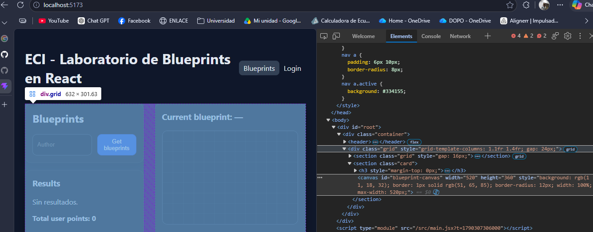

**Evidencia — suite de pruebas:**

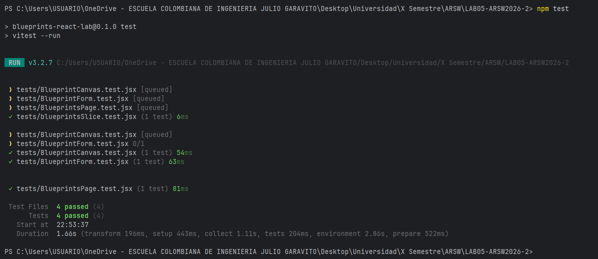


## 2. Listar los planos de un autor

- Permitir ingresar el nombre de un autor y consultar sus planos desde el backend (o mock).
- Mostrar los resultados en una tabla con las siguientes columnas:
  - Nombre del plano
  - Número de puntos
  - Botón `Open` para abrirlo

### Respuesta y evidencia

El input de autor, botón "Get blueprints" y la tabla con las 3 columnas exactas ya existían en `src/pages/BlueprintsPage.jsx`. Al conectarlo con datos reales del backend, aparecieron dos bugs que hubo que corregir:

**Bug 1 — desempaquetado de la respuesta:** los thunks de `blueprintsSlice.js` guardaban `response.data` completo (el envoltorio `{code, message, data}`) en vez de `response.data.data`, causando `TypeError: items.reduce is not a function` en la página.

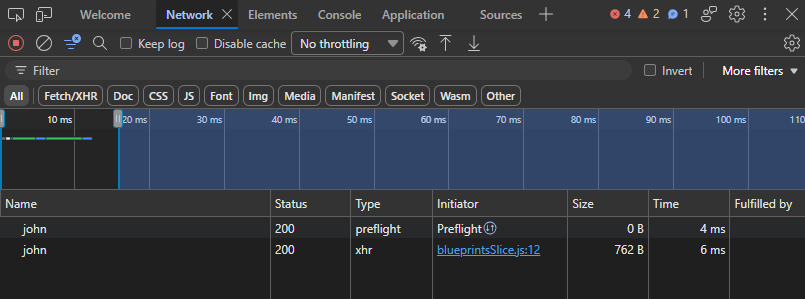
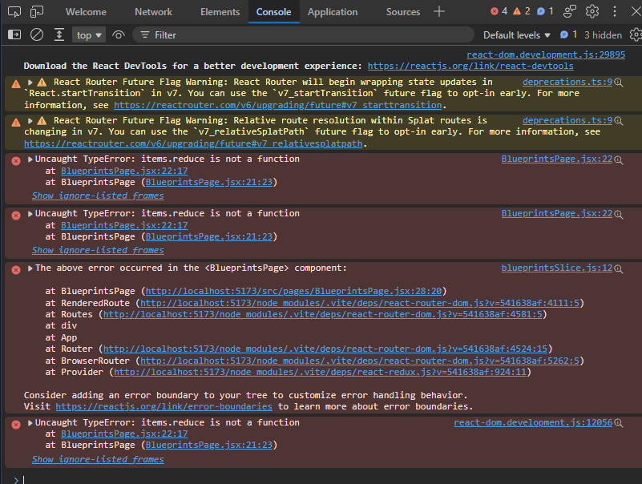

Se corrigió con desestructuración anidada: `const { data: { data } } = await api.get(...)`.

**Evidencia — funcionando con datos reales del backend:**

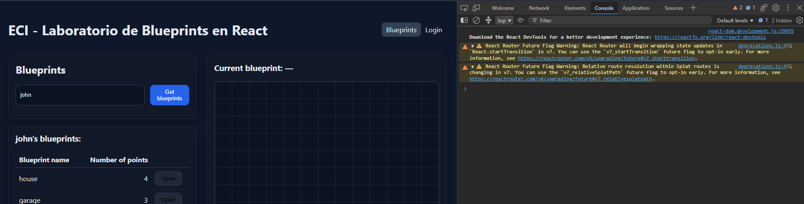

`GET /api/v1/blueprints/john` → `200`, tabla mostrando `house` (4 puntos) y `garage` (3 puntos), `Total user points: 7`.

## 3. Seleccionar un plano y graficarlo

Al hacer clic en el botón `Open`, debe:

- Actualizar un campo de texto con el nombre del plano actual.
- Obtener los puntos del plano correspondiente.
- Dibujar consecutivamente los segmentos de recta en el canvas y marcar cada punto.

### Respuesta y evidencia

El botón `Open` ya disparaba `fetchBlueprint` y actualizaba `current.name` desde Redux. Al probarlo con datos reales, apareció un bug de escalado: `BlueprintCanvas.jsx` dibujaba los puntos usando sus coordenadas crudas del modelo directamente como píxeles del canvas — como los puntos de `house` van de `(0,0)` a `(10,10)`, la figura completa quedaba invisible en una esquina de 10×10 píxeles.

**Evidencia — antes del fix (sin escalar):**

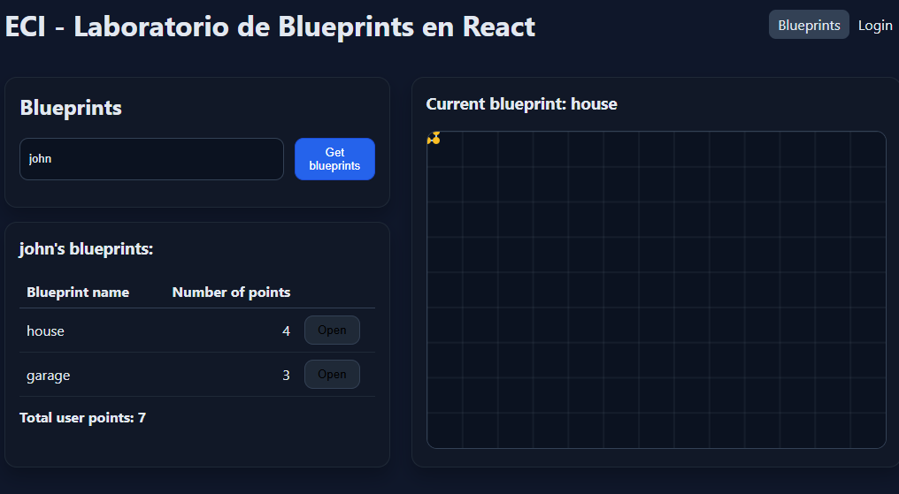
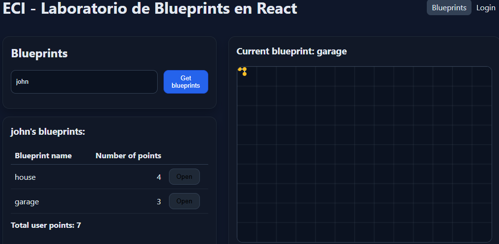

Se agregó una función `toScreen(p)` que calcula el rango (`min`/`max`) de las coordenadas de los puntos y las escala al tamaño del canvas con margen, antes de dibujarlas.

**Evidencia — después del fix:**

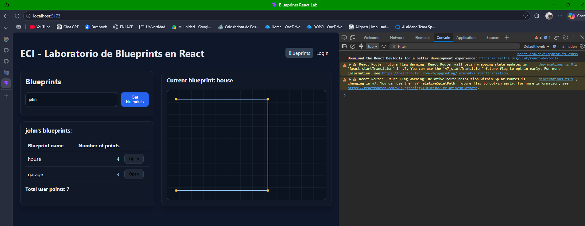

## 4. Servicios: `apimock` y `apiclient`

- Implementar dos servicios con la misma interfaz:
  - `apimock`: retorna datos de prueba desde memoria.
  - `apiclient`: consume el API REST real con Axios.
- La interfaz de ambos debe incluir los métodos:
  - `getAll`
  - `getByAuthor`
  - `getByAuthorAndName`
  - `create`
- Habilitar el cambio entre `apimock` y `apiclient` con una sola línea de código:
  - Definir un módulo `blueprintsService.js` que importe uno u otro según una variable en `.env`.
  - Ejemplo en `.env` (Vite):

```env
VITE_USE_MOCK=true
```

- `VITE_USE_MOCK=true` usa el mock.
- `VITE_USE_MOCK=false` usa el API real.


### Respuesta y evidencia

Se implementaron `src/services/blueprintsApiMock.js` y `src/services/blueprintsApiClient.js`, ambos con la interfaz `{getAll, getByAuthor, getByAuthorAndName, create}`, seleccionados por `src/services/blueprintsService.js` según `VITE_USE_MOCK`. `blueprintsSlice.js` se modificó para depender únicamente de `blueprintsService`, sin conocer la implementación concreta.

> **Nota de nombres:** no se usó literalmente `apimock.js`/`apiclient.js` porque Windows no distingue mayúsculas/minúsculas en archivos, y ya existía `apiClient.js` (la instancia de axios) — coexistir con un `apiclient.js` habría causado conflictos de Git específicos de ese sistema operativo. Se usaron `blueprintsApiMock.js`/`blueprintsApiClient.js` para mantener el mismo patrón sin el conflicto.

**Evidencia — `VITE_USE_MOCK=false` (backend real), sin sesión iniciada:** la petición sale hacia el backend real y es rechazada (`401`, comportamiento correcto de seguridad):

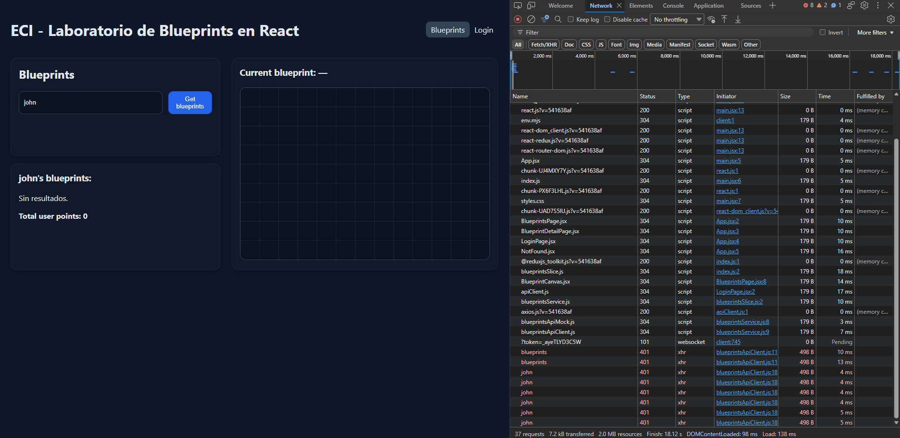

**Evidencia — `VITE_USE_MOCK=true`, sin sesión iniciada:** Local Storage confirmado vacío (sin token) y, aun así, los datos se muestran correctamente:

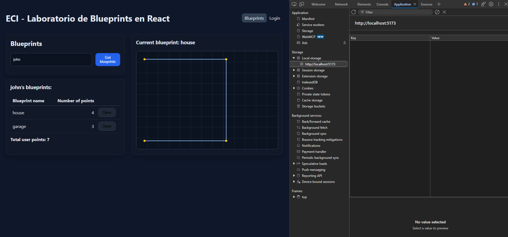

Y ninguna petición sale hacia `localhost:8080`:

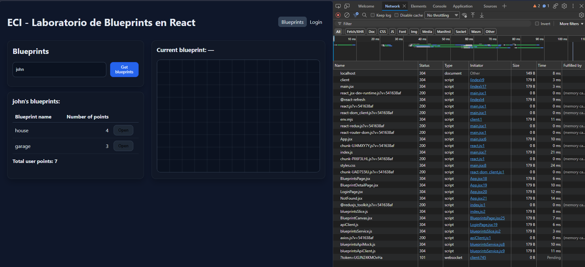

**Pruebas automatizadas del switch (ver Punto 7):** `tests/blueprintsService.test.jsx` verifica programáticamente que `VITE_USE_MOCK` selecciona la implementación correcta y que el mock respeta el contrato de la interfaz.
## 5. Interfaz con React

- El nombre del plano actual debe mostrarse en el DOM como parte del estado global (Redux).
- Evitar manipular directamente el DOM; usar componentes y props/estado.


### Respuesta y evidencia

**Requisito 1:** confirmado en `BlueprintsPage.jsx` — `current` se lee del store de Redux vía `useSelector`, y se muestra en `<h3>Current blueprint: {current?.name || '—'}</h3>`.

**Requisito 2:** se revisó todo `src/` buscando manipulación imperativa del DOM (`grep -rn "document\.\|getElementById\|querySelector\|innerHTML" src/`). El único resultado fue `main.jsx:9` (`ReactDOM.createRoot(document.getElementById('root'))`), el punto de montaje estándar y obligatorio de cualquier app React. El único uso de una API imperativa en el proyecto es `BlueprintCanvas.jsx`, vía `useRef` + contexto 2D del canvas — el patrón oficial de React para APIs sin equivalente declarativo.

**Mejora adicional (no pedida explícitamente, pero corrige un hallazgo real):** se detectó que el `extraReducers` de `blueprintsSlice.js` no manejaba el caso `.rejected` de ningún thunk — un `401` por falta de login era indistinguible de "no hay resultados". Se agregó manejo de errores con `rejectWithValue` y mensajes traducidos por status HTTP.

**Evidencia — error visible en vez de "Sin resultados" silencioso:**

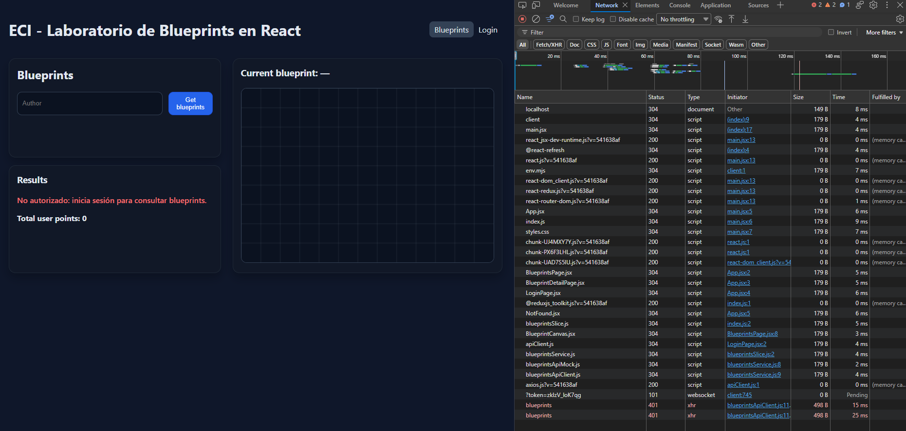

## 6. Estilos

- Agregar estilos para mejorar la presentación.
- Se puede usar Bootstrap u otro framework CSS.
- Ajustar la tabla, botones y tarjetas para acercarse al mock de referencia.


### Respuesta y evidencia

**Sobre el "mock de referencia":** se investigó el *"cliente HTML/JS del repo de referencia"* mencionado en la introducción de este README. Se revisaron los repositorios Lab03-ARSW2026-2 y Lab04-ARSW2026-2 (los antecedentes directos de este proyecto) sin encontrar tal cliente HTML/JS ni ningún archivo de diseño — ambos son backends puros, sin recursos estáticos de frontend. Ante la ausencia de un mock específico disponible, se aplicaron mejoras de estilo con base en buenas prácticas generales, manteniendo la paleta e identidad visual ya presente en `styles.css`.

**Cambios aplicados:** clases dedicadas para la tabla (`.table`, `.table-wrap`, hover en filas, alineación numérica), estados de interacción en botones (`hover`, `disabled`), y clases semánticas para mensajes de estado (`.error-text`, `.empty-state`, `.total-points`). Se migró la tabla de `BlueprintsPage.jsx` de estilos inline a estas clases.

`src/components/BlueprintList.jsx` se identificó como componente no conectado a ninguna ruta (confirmado con `grep`). Se decidió **conservarlo sin usar**, como vista alternativa en tarjetas ya implementada pero no habilitada en la navegación actual.

**Evidencia:**

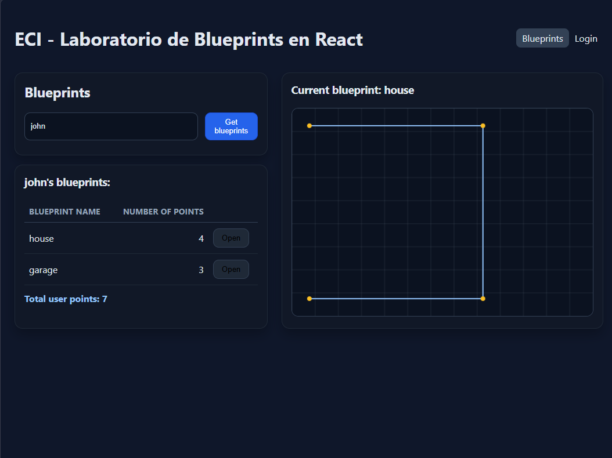


## 7. Pruebas unitarias

- Agregar pruebas con Vitest + Testing Library para validar:
  - Render del canvas.
  - Envío de formularios.
  - Interacciones básicas con Redux (por ejemplo: dispatch de `fetchByAuthor`).


### ✅ Respuesta y evidencia

Los 3 requisitos están cubiertos:

| Requisito | Test |
|---|---|
| Render del canvas | `tests/BlueprintCanvas.test.jsx` |
| Envío de formularios | `tests/BlueprintForm.test.jsx` |
| Interacción con Redux (`dispatch(fetchByAuthor)`) | `tests/BlueprintsPage.test.jsx` |

`BlueprintsPage.test.jsx` usa `vi.mock()` sobre el slice completo (no sobre axios/apiClient), por lo que quedó desacoplado de la implementación interna del thunk — siguió pasando sin cambios pese a que el Punto 4 reescribió por completo cómo el slice obtiene los datos.

Se agregó además `tests/blueprintsService.test.jsx` (4 pruebas) para cubrir el propio mecanismo de selección mock/real del Punto 4: que `VITE_USE_MOCK` seleccione la implementación correcta, y que el mock respete el contrato de la interfaz (`getByAuthor`, `getByAuthorAndName`).

**Evidencia — suite completa final** *(sin captura incrustada; resultado transcrito directamente de la terminal)*:

```
Test Files  5 passed (5)
     Tests  8 passed (8)
 Duration  2.27s
```
---

### Notas rápidas y recomendaciones

- Para el canvas en tests con jsdom: agregar un mock de `HTMLCanvasElement.prototype.getContext` en `tests/setup.js`.
- Para usar `@testing-library/jest-dom` con Vitest: en `tests/setup.js` importar `import '@testing-library/jest-dom'` y asegurarse de que Vitest provea el global `expect` (configurar `vitest.config.js` con la opción `test: { globals: true, setupFiles: './tests/setup.js' }`).
- Para la conmutación de servicios en Vite, usar `import.meta.env.VITE_USE_MOCK` para leer la variable en tiempo de ejecución.

## 📌 Recomendaciones y actividades sugeridas para el exito del laboratorio

1. **Redux avanzado**
   - [ ] Agrega estados `loading/error` por _thunk_ y muéstralos en la UI.
   - [ ] Implementa _memo selectors_ para derivar el top-5 de blueprints por cantidad de puntos.
2. **Rutas protegidas**
   - [ ] Crea un componente `<PrivateRoute>` y protege la creación/edición.
3. **CRUD completo**
   - [ ] Implementa `PUT /api/blueprints/{author}/{name}` y `DELETE ...` en el slice y en la UI.
   - [ ] Optimistic updates (revertir si falla).
4. **Dibujo interactivo**
   - [ ] Reemplaza el `svg` por un lienzo donde el usuario haga _click_ para agregar puntos.
   - [ ] Botón “Guardar” que envíe el blueprint.
5. **Errores y _Retry_**
   - [ ] Si `GET` falla, muestra un banner y un botón **Reintentar** que dispare el thunk.
6. **Testing**
   - [ ] Pruebas de `blueprintsSlice` (reducers puros).
   - [ ] Pruebas de componentes con Testing Library (render, interacción).
7. **CI/Lint/Format**
   - [ ] Activa **GitHub Actions** (workflow incluido) → lint + test + build.
8. **Docker (opcional)**
   - [ ] Crea `Dockerfile` (+ `compose`) para front + backend.

## Criterios de evaluación

- Funcionalidad y cobertura de casos (30%)
- Calidad de código y arquitectura (Redux, componentes, servicios) (25%)
- Manejo de estado, errores, UX (15%)
- Pruebas automatizadas (15%)
- Seguridad (JWT/Interceptores/Rutas protegidas) (10%)
- CI/Lint/Format (5%)

## Scripts

- `npm run dev` – servidor de desarrollo Vite
- `npm run build` – build de producción
- `npm run preview` – previsualizar build
- `npm run lint` – ESLint
- `npm run format` – Prettier
- `npm test` – Vitest

---

### Extensiones propuestas del reto

- **Redux Toolkit Query** para _caching_ de requests.
- **MSW** para _mocks_ sin backend.
- **Dark mode** y diseño responsive.

> Este proyecto es un punto de partida para que tus estudiantes evolucionen el cliente clásico de Blueprints a una SPA moderna con prácticas de la industria.
